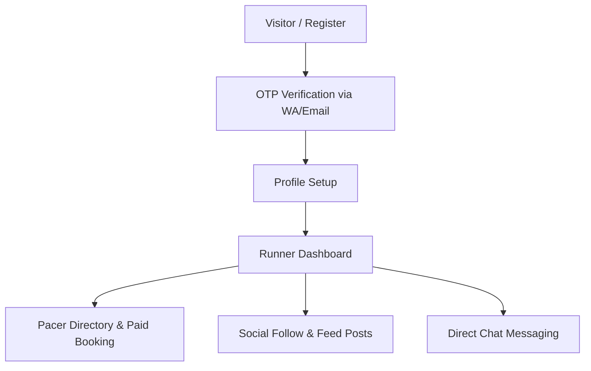
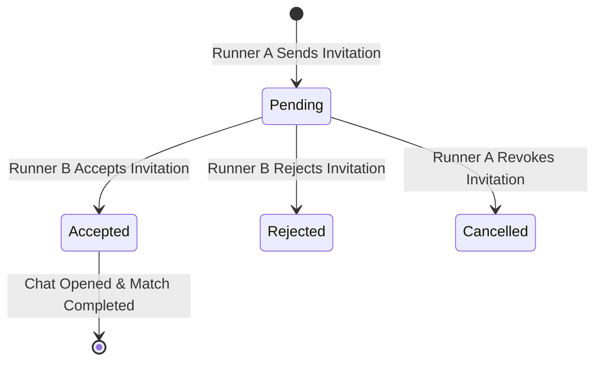

# Find My Pacer / Running Buddy: System Analysis & Implementation Plan

This document provides a comprehensive system analysis and technical design plan for implementing the **Find My Pacer / Running Buddy** feature in the Ruang Lari application.

---

## 1. Executive Summary
The "Find My Pacer / Running Buddy" feature aims to increase runner engagement and retention by allowing active runners to discover each other nearby, connect, and schedule runs. By enabling real-time location-based discovery under a strict, opt-in privacy model, the platform will facilitate organic running groups and match runners of similar skill levels (VDOT, target pace).

### Core Goals
- **Opt-in Discovery**: Protect user privacy with approximate coordinates.
- **Interactive Experience**: Support both card-based swiping and map-based pin exploration.
- **Match Mechanism**: Facilitate request and approval flows before opening communication channels.
- **High Performance**: Optimize spatial queries to prevent server strain.

---

## 2. Verified Existing Architecture
The Ruang Lari codebase has been audited to confirm the technical boundaries:
- **Backend Framework**: Laravel 12.0
- **Frontend Engine**: Hybrid architecture with standard Laravel Blade templates and Inertia.js with Vue 3.5.25.
- **Styling**: Tailwind CSS v4.0.0 integrated via Vite.
- **Database**: MySQL/MariaDB database with standard Eloquent relations.
- **Existing Maps Integration**: Mapbox token configuration is active via `.env` (`MAPBOX_TOKEN`) and loaded in routes tool views (`pace-pro.blade.php`, `buat-rute-lari.blade.php`).
- **Existing Communication**: Chat system exists using `ChatController` with `Message` model. Social interactions use a `Follow` model.

---

## 3. Current User and Runner Flow
Below is a visual flow of the current runner registration and social/booking capabilities:



---

## 4. Gap Analysis
The following table outlines what is missing from the current system to support the Buddy Finder MVP:

| Component | Current State | Required State for Buddy Finder | Gaps Identified |
| :--- | :--- | :--- | :--- |
| **Database** | `users` table contains general profile info, VDOT metrics, and target PBs. | `users` table must support geolocation, discoverability state, and expiration timestamps. | Lacks columns: `is_discoverable`, `discoverable_expires_at`, `approx_latitude`, `approx_longitude`. |
| **Relationships**| Followers/Followings exist via `follows`. Pacer bookings exist. | Mutual matching status and explicit invitation states. | Missing match table (`buddy_invitations`) and blocklist table (`user_blocks`). |
| **API Endpoints** | Standard profile updates and chat APIs exist. | Coordinates update, active search with spatial filtering, request matching actions. | Lacks discovery API controllers and FormRequest validations. |
| **Frontend** | Separate Blade views for profiles and calendar dashboard. | Responsive SPA Interface for Swipe and Map interactions. | No Inertia/Vue layout or shell page for Buddy Discovery. |
| **Notifications**| Database-backed notifications exist. | Trigger alerts on incoming requests and mutual matches. | Missing Buddy Request notification class and database types. |

---

## 5. Proposed Product Flow
The complete user journey is detailed in 8 steps below:

```
[1. Opt-in Toggle] -> [2. Geolocation Request] -> [3. Obfuscation & Jitter] -> [4. Discovery Page]
                                                                                   |
                                                                                   v
[8. Chat & Sync]   <- [7. Notification Mutual] <- [6. Invitation Request]  <- [5. Browse Map/Swipe]
```

1. **Opt-in Toggle**: Runner toggles "Find Buddy Mode" on.
2. **Geolocation Request**: System requests browser location access.
3. **Obfuscation & Jitter**: Coordinates are adjusted (jittered or snapped) before storage to prevent accurate tracking.
4. **Discovery Page**: User is redirected to a unified discovery SPA dashboard.
5. **Browse Map/Swipe**: User toggles between Map and Swipe view, filtering by Pace, VDOT, and Gender.
6. **Invitation Request**: User sends a connection request with a custom meeting point or message.
7. **Notification Mutual**: Recipient receives a notification and accepts the invite.
8. **Chat & Sync**: Mutual match opens a temporary chat channel and presents follow options.

---

## 6. Single-Page Information Architecture
The frontend will be built as a single unified Vue page (`resources/js/Pages/Runner/BuddyFinder.vue`) supporting two main discovery panels:

```
+-------------------------------------------------------------------+
|  [Find Running Buddy]                    Toggle: [ Active / Off ]  |
+-------------------------------------------------------------------+
|  Filters: [ Pace: 5:00 ] [ Gender: All ] [ Radius: 10km ] [Edit]  |
+-------------------------------------------------------------------+
|  VIEW: [ Swipe Deck ] | [ Interactive Map ]                       |
|                                                                   |
|  +---------------------------+   +-----------------------------+  |
|  |       SWIPE DECK          |   |          MAP VIEW           |  |
|  |  +---------------------+  |   |  +-----------------------+  |  |
|  |  | [Runner Photo]      |  |   |  |   [Mapbox Container]  |  |
|  |  | Name: Budi, 28      |  |   |  |  (Jittered Pins)      |  |
|  |  | Pace: 5:30/km       |  |   |  |   O     O      O      |  |
|  |  | VDOT: 42.1          |  |   |  |        [User]         |  |
|  |  +---------------------+  |   |  +-----------------------+  |  |
|  |  ( [Skip]   [Connect] )   |   |  Click Pin -> Card Popup    |  |
|  +---------------------------+   +-----------------------------+  |
+-------------------------------------------------------------------+
```

---

## 7. Discoverability State Design
Privacy is maintained by controlling the lifecycle of the user's location state:
- **Default State**: `is_discoverable` is set to `false`.
- **Opt-in Action**: When enabled, the application requests coordinates, uploads them via API, and sets `discoverable_expires_at` to `now()->addHours(24)`.
- **Auto Expiration**: An automated scheduled task resets users to inactive after 24 hours of inactivity.
- **Opt-out Action**: Users can manually toggle discoverability off at any time, clearing coordinate data instantly.

---

## 8. Swipe Discovery Design
The card-based swipe layout displays concise details for rapid scanning:
- **Visual Deck**: CSS transitions animate cards to the left (skip) or right (connect).
- **Profile Summary**: Displays avatar, display name, general age group (e.g. 25-30), target pace, and VDOT index.
- **Social Indicators**: Highlights mutual interests, shared events, or mutual follows.
- **Reporting Shortcut**: A flag icon opens a modal to immediately report or block the runner.

---

## 9. Map Discovery Design
Integration with Mapbox utilizes existing assets and adheres to strict privacy rules:

### Map Provider Comparison
- **Google Maps**: Reliable but incurs high API fees for dynamic loading.
- **Mapbox**: Recommended. Currently integrated in Ruang Lari; allows customized running-themed styles.

### Privacy Snapping and Coordinates Jittering
To prevent exact home address mapping, the system does not store absolute coordinates.
- **Offset Jittering**: Coordinates are adjusted with a random polar coordinate offset:
  $$\text{Lat}_{approx} = \text{Lat} + R \cdot \cos(\theta)$$
  $$\text{Lng}_{approx} = \text{Lng} + R \cdot \sin(\theta)$$
  Where $R$ ranges randomly between $300\text{m}$ and $700\text{m}$ (in degrees equivalent).
- **Point of Interest (POI) Snapping**: Snaps location to the nearest public running track, park, or city center within a $2\text{km}$ radius.

---

## 10. Search and Filter Specification
Search results will be queried based on the following rules:
- **Radius**: Choice of 5km, 10km, 25km, or 50km.
- **Pace Tolerance**: Filter runners within $\pm 45$ seconds/km of the current runner's target pace.
- **VDOT Matching**: Optional toggle to restrict discovery to runners within $\pm 5$ VDOT levels.
- **Schedule**: Filter by running schedule preference (Morning, Evening, Weekend).
- **Gender**: Option to restrict search results to the same gender.

---

## 11. Matching and Invitation Flow
Matches are established through clear transactional stages:



### Reporting & Blocking Rules
- A user can block another runner at any time.
- Blocking immediately deletes any existing pending invitations between both parties.
- Blocked relationships are recorded in `user_blocks` and filtered out of spatial query results.

---

## 12. Proposed Data Model Changes

### Added Columns to `users` Table
```sql
ALTER TABLE users ADD COLUMN is_discoverable BOOLEAN DEFAULT FALSE;
ALTER TABLE users ADD COLUMN discoverable_expires_at TIMESTAMP NULL;
ALTER TABLE users ADD COLUMN approx_latitude DECIMAL(10, 8) NULL;
ALTER TABLE users ADD COLUMN approx_longitude DECIMAL(11, 8) NULL;
```

### New Tables
#### `buddy_invitations`
Tracks invitation records and custom invites.

| Column | Type | Attributes | Description |
| :--- | :--- | :--- | :--- |
| `id` | BIGINT | Primary Key, Auto Increment | Unique Identifier |
| `sender_id` | foreignId | Constrained to `users`, Cascade | Runner sending request |
| `receiver_id` | foreignId | Constrained to `users`, Cascade | Target runner |
| `status` | ENUM | default 'pending' | 'pending', 'accepted', 'rejected', 'cancelled' |
| `proposed_location`| VARCHAR(255) | Nullable | Optional meeting point |
| `message` | TEXT | Nullable | Optional intro note |
| `created_at` | TIMESTAMP | Nullable | Timestamp |
| `updated_at` | TIMESTAMP | Nullable | Timestamp |

#### `user_blocks`
Ensures mutual blocks prevent discoverability.

| Column | Type | Attributes | Description |
| :--- | :--- | :--- | :--- |
| `id` | BIGINT | Primary Key | Unique ID |
| `user_id` | foreignId | Constrained to `users` | The blocking user |
| `blocked_user_id` | foreignId | Constrained to `users` | The blocked user |
| `reason` | VARCHAR(255) | Nullable | Optional note |
| `created_at` | TIMESTAMP | Nullable | Timestamp |

---

## 13. Proposed Backend Changes
1. **Controllers**:
   - `BuddyDiscoveryController`: Handles discovery listings, radius queries, and toggling discoverability.
   - `BuddyInvitationController`: Manages invitations (create, accept, reject, cancel).
   - `BuddyBlockController`: Manages user blocks.
2. **FormRequests**:
   - `UpdateLocationRequest`: Validates client GPS input and handles coordinate fuzzing.
   - `SendInvitationRequest`: Validates target recipient and input constraints.
3. **Services**:
   - `FuzzyLocationService`: Encapsulates spatial jitter calculations.
4. **Scheduled Jobs**:
   - `DeactivateExpiredDiscoverability`: Runs hourly to clear expired locations (`discoverable_expires_at < now()`).

---

## 14. Proposed Vue Changes
A new Inertia Page and related components will be created in `resources/js/Pages/Runner/BuddyFinder`:
- **`Index.vue`**: Main screen holding state (view toggles, active filter object, coordinate properties).
- **`SwipeDeck.vue`**: Integrates gesture listeners for swipe interactions.
- **`MapPanel.vue`**: Imports Mapbox GL JS dynamically, placing custom markers for nearby runners and showing info-cards on click.
- **`FilterDrawer.vue`**: Sidebar component for search criteria.

---

## 15. API Contract Draft

### 1. Toggle Discoverability & Update Geolocation
- **Endpoint**: `POST /api/buddies/toggle`
- **Request Payload**:
```json
{
  "is_discoverable": true,
  "latitude": -6.2088,
  "longitude": 106.8456
}
```
- **Response**:
```json
{
  "success": true,
  "message": "Discoverability status updated successfully.",
  "data": {
    "is_discoverable": true,
    "approx_latitude": -6.21123,
    "approx_longitude": 106.84234,
    "expires_at": "2026-06-17T20:00:00Z"
  }
}
```

### 2. Retrieve Discovery List
- **Endpoint**: `GET /api/buddies/discover`
- **Query Parameters**: `radius=10`, `gender=all`, `target_pace=05:30`
- **Response**:
```json
{
  "success": true,
  "data": [
    {
      "id": 42,
      "name": "Dafid Sandi",
      "approx_latitude": -6.21301,
      "approx_longitude": 106.84920,
      "distance_km": 1.4,
      "target_pace": "05:15",
      "vdot": 44.5,
      "gender": "male"
    }
  ]
}
```

### 3. Send Invitation
- **Endpoint**: `POST /api/buddies/invitations`
- **Request Payload**:
```json
{
  "receiver_id": 42,
  "proposed_location": "Gelora Bung Karno",
  "message": "Let's run 10k together this Sunday!"
}
```
- **Response**:
```json
{
  "success": true,
  "invitation_id": 105,
  "status": "pending"
}
```

---

## 16. Performance Strategy
- **Spatial Indexing**: Add database indices on `is_discoverable`, `discoverable_expires_at`, and coordinates.
- **Query Optimization**: Calculate Haversine distance in SQL dynamically to filter out-of-range users before loading runner objects.
- **Map Lazy Loading**: Defer rendering the Mapbox components until the user opens the Map View tab, saving battery and data usage.
- **Rate-Limiting**: Limit coordinate updates to a maximum of once every 10 minutes.

---

## 17. Security and Privacy Review
- **Exact Location Obfuscation**: Jitter algorithm calculates fuzzy coordinates exclusively server-side. Absolute coordinates are discarded instantly and never written to logs or database storage.
- **Harassment Mitigation**: Block list query restrictions run inside a global scope middleware ensuring blocked users can never see each other.
- **Rate Limiting Discoverability Searches**: Discovery endpoints are throttled to 20 queries/minute to prevent bots from mapping coordinates incrementally.

---

## 18. MVP Scope

### Included in MVP
- Discoverability opt-in/opt-out toggle with 24h automatic expiration.
- Coordinates jitter algorithm (server-side polar offset).
- Vue SPA page supporting Swipe UI and Mapbox map.
- Invitation send/receive status workflow.
- Notification alerts on match completion.
- Basic user blocklist.

### Deferred to Version 2
- Real-time location updates (dynamic moving dots).
- Snapping coordinates to specific GPX routes.
- Group run scheduling.
- Auto-syncing Strava running routes to discovery profiles.

---

## 19. Recommended Implementation Stages

```
Stage 1: DB & Migration
   |---> Stage 2: Location Obfuscation & Discovery API
            |---> Stage 3: Invitation & Match Logic
                     |---> Stage 4: Single-Page Vue Shell
                              |---> Stage 5: Mapbox & Swipe Frontend UI
                                       |---> Stage 6: Testing & Launch
```

- **Stage 1 (Database)**: Run migrations to add coordinates and create invitations/blocks tables.
- **Stage 2 (API Foundation)**: Develop location endpoints and apply coordinates jittering.
- **Stage 3 (Matching Engine)**: Code invitation routing, validation controllers, and event notifications.
- **Stage 4 (UI Shell)**: Build the parent Vue component page inside Inertia paths.
- **Stage 5 (Map & Swipe)**: Implement Mapbox rendering and card swipe deck.
- **Stage 6 (QA & Launch)**: Verify distance calculation, test blocking mechanism, and launch.

---

## 20. Open Decisions
- **WhatsApp Integration**: Should notifications trigger instant WhatsApp alerts using the existing system channel? (Recommended for higher engagement).
- **Fuzzy Radius**: Is a random 300m - 700m radius large enough to prevent homes from being identified in lower-density suburban zones?
- **Auto-Disable Duration**: Should the timeout be shortened to 12 hours to keep the map populated only with active, online runners?

---

## 21. Final Recommendation
Integrating a dedicated SPA buddy finder with fuzzed Mapbox pins utilizes existing assets efficiently. This architecture preserves user privacy, adheres strictly to clean code practices, and creates a highly interactive, modern feature set for Ruang Lari's active user base.
